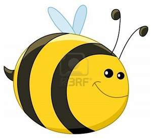

# lab4-2811-keane-senebouttarath

Bees lab implementation for SE 2811. 

TODO: Delete dis
minecraft bee minecraft bee minecraft bee minecraft bee minecraft bee minecraft bee minecraft bee minecraft bee minecraft bee minecraft bee minecraft bee minecraft bee minecraft bee minecraft bee minecraft bee minecraft bee minecraft bee minecraft bee minecraft bee minecraft bee minecraft bee minecraft bee minecraft bee minecraft bee minecraft bee minecraft bee minecraft bee minecraft bee minecraft bee minecraft bee minecraft bee minecraft bee minecraft bee minecraft bee minecraft bee minecraft bee minecraft bee minecraft bee minecraft bee minecraft bee minecraft bee minecraft bee minecraft bee minecraft bee minecraft bee minecraft bee minecraft bee minecraft bee minecraft bee minecraft bee minecraft bee minecraft bee minecraft bee minecraft bee minecraft bee minecraft bee minecraft bee minecraft bee minecraft bee minecraft bee minecraft bee minecraft bee minecraft bee minecraft bee minecraft bee minecraft bee minecraft bee minecraft bee minecraft bee minecraft bee minecraft bee minecraft bee minecraft bee minecraft bee minecraft bee minecraft bee minecraft bee minecraft bee minecraft bee minecraft bee minecraft bee minecraft bee minecraft bee minecraft bee minecraft bee minecraft bee minecraft bee minecraft bee minecraft bee minecraft bee minecraft bee minecraft bee 
